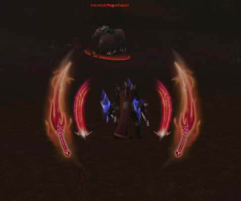

# ProcDoc

**ProcDoc** is a lightweight World of Warcraft (Turtle WoW / Vanilla) addon that shows pulsing visuals whenever your character gains an instant-cast or free-cast buff—like Clearcasting, Shadow Trance, Overpower, etc. It automatically detects procs and displays on-screen alerts in a fun and noticeable way.

---

## Key Features

1. **Visual Alerts for Procs**  
   Displays large, pulsing textures around or above your character whenever a supported proc is active.

2. **Multiple Buff Support**  
   Supports many instant/free-cast buff procs (e.g. Shadow Trance, Clearcasting, Overpower), each with unique textures and placement.

3. **No Manual Setup Needed**  
   Simply install and go—proc detection is automatic. An in-game options panel (via `/procdoc`) lets you test custom visuals and tweak appearance settings.

4. **Timers for Each Proc**
   Timers to show you how long you have to cast your spells before time expires.
   
---

## Installation

1. **Open Up Turtle-WoW Launcher** and click on the  **`ADDONS`** tab at the top of the window.

2. **Scroll Down** to the **`AVAILABLE`** tab and find the **ProcDoc** addon. Click the Download button to the right. This will complete the installation of the addon and there is no need to move forward.

3. **If ProcDoc is not in the `AVAILABLE` tab,** at the bottom of the window press `+ Add new addon`. A new screen will appear that says `Enter a URL to install the addon from.`

4. **In the text box,** enter in the web address `https://github.com/wsmaxcy/ProcDoc`. If done correctly, a github repository will appear and you will see a beautiful face appear in the window.

5. **Press Install** and you're good to go! Enjoy your proc animations!

---

## How to Use

1. **Log In**: Enter the game with any class that has procs (Warrior, Mage, Priest, etc.).
2. **Trigger a Proc**: Cast spells or fight until you get an “instant cast” buff (e.g. Clearcasting).
3. **See the Alert**: Pulsing textures appear in the chosen style (**SIDES** or **TOP**).
4. **Buff Ends**: The alert automatically disappears when the buff expires.

**Done!** You can also open the addon’s panel with **`/procdoc`** to test procs, modify transparency, or adjust offsets.
**Note**: For action based spell alerts, the spell must be on one of your action bars. For instance **Overpower**, **Riposte**, **Judgement**, etc.

---

## Configuration

- **Min/Max Transparency**: Controls how faint or bright the pulsing effect can get.
- **Min/Max Size**: Changes how small or large the images become during pulsing.
- **Pulse Speed**: Adjusts how quickly the images fade in/out.
- **Offsets**: Shifts the alerts vertically (top) or horizontally (sides).
- **Sound Alerts**: Comes with a sound alert that will trigger when any proc is activated. Can be muted in the menu. This is tied to the `Master` volume, so if you would like to change the volume of the alert, use that slider.
You can experiment with these in the **`/procdoc`** panel. Changes are saved automatically.

---

## Supported Procs

  
<strong>ProcDoc</strong> supports a variety of procs and alerts when key abilities or buffs become available for each class. Below is a list of currently supported procs:

  <h3><strong>Warlock</strong></h3>
  
    <li><strong>Shadow Trance (Nightfall)</strong></li>

  <h3><strong>Mage</strong></h3>
  
    <li><strong>Clearcasting</strong></li>
    <li><strong>Netherwind Focus</strong></li>
    <li><strong>Temporal Convergence</strong></li>
    <li><strong>Flash Freeze</strong></li>
    <li><strong>Arcane Surge</strong></li>
    <li><strong>Arcane Rupture</strong></li>

  <h3><strong>Warrior</strong></h3>
  
    <li><strong>Enrage</strong></li>
    <li><strong>Overpower</strong></li>
    <li><strong>Execute</strong></li>
    <li><strong>Revenge</strong></li>
    <li><strong>Counterattack</strong></li>

  <h3><strong>Druid</strong></h3>
  
    <li><strong>Clearcasting</strong></li>
    <li><strong>Nature’s Grace</strong></li>
    <li><strong>Tiger's Fury</strong></li>
    <li><strong>Astral Boon</strong></li>
    <li><strong>Natural Boon</strong></li>
    <li><strong>Arcane Eclipse</strong></li>
    <li><strong>Nature Eclipse</strong></li>

  <h3><strong>Rogue</strong></h3>
  
    <li><strong>Remorseless</strong></li>
    <li><strong>Riposte</strong></li>
    <li><strong>Surprise Attack</strong></li>
    <li><strong>Tricks of the Trade</strong></li>

  <h3><strong>Shaman</strong></h3>
  
    <li><strong>Clearcasting</strong></li>
    <li><strong>Nature's Swiftness</strong></li>
    <li><strong>Stormstrike</strong></li>
    <li><strong>Flurry</strong></li>

  <h3><strong>Priest</strong></h3>
  
    <li><strong>Resurgence</strong></li>
    <li><strong>Enlightened</strong></li>
    <li><strong>Searing Light</strong></li>
    <li><strong>Shadow Veil</strong></li>
    <li><strong>Spell Blasting</strong></li>

  <h3><strong>Hunter</strong></h3>
  
    <li><strong>Quick Shots</strong></li>
    <li><strong>Lacerate</strong></li>
    <li><strong>Baited Shot</strong></li>

  <h3><strong>Paladin</strong></h3>
  
    <li><strong>Hammer of Wrath</strong></li>
    <li><strong>Daybreak</strong></li>
    <li><strong>Hammer of Justice</strong></li>
    <li><strong>Judgement</strong></li>

<!-- END: Centered Supported Procs -->

### Additional Notes
- The list includes both classic procs and custom procs unique to Turtle WoW.
- New procs and alerts can easily be added by modifying the configuration in the `PROC_DATA` and `ACTION_PROCS` tables in the code. That, or hit me up and I can add it to the main addon!

---

## License

Feel free to use, modify, or share **ProcDoc**. A mention or credit is welcome but not required. Enjoy your new proccing visuals!
